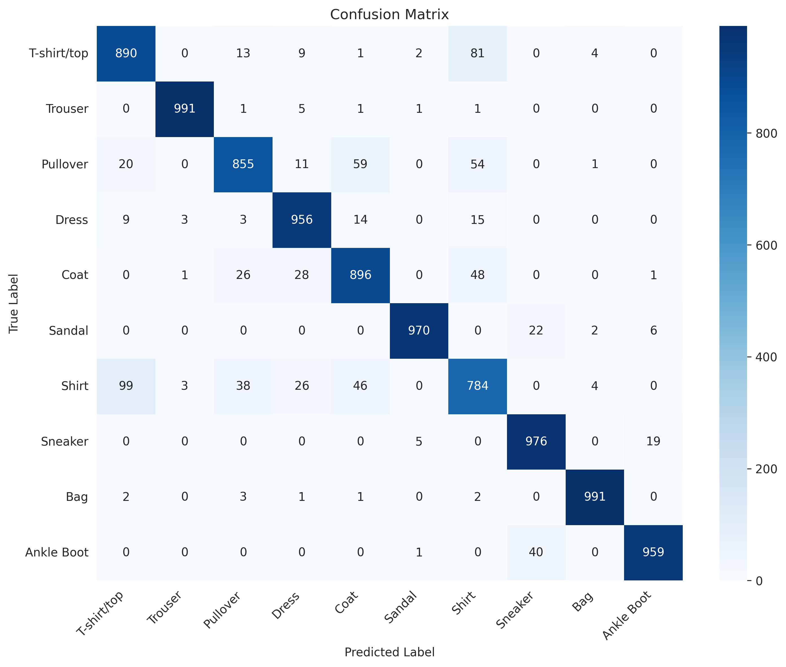
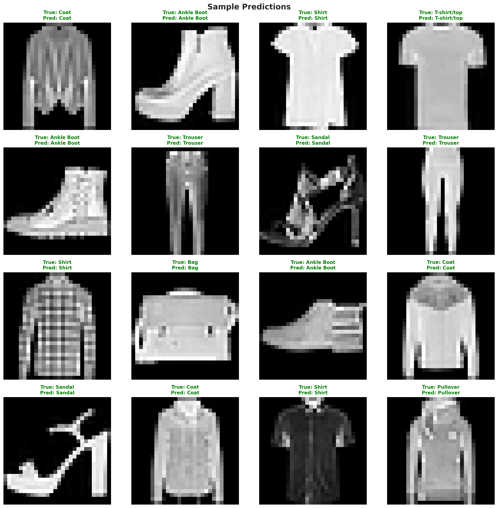

# 👔 Fashion-MNIST Image Classification with CNN

A deep learning project that classifies fashion items into 10 categories using Convolutional Neural Networks (CNN). This project includes model training, evaluation, and a Streamlit web application.

---

## 📋 Table of Contents

- [Overview](#overview)
- [Dataset](#dataset)
- [Features](#features)
- [Model Architecture](#model-architecture)
- [Installation](#installation)
- [Results](#results)

---

## 🎯 Overview

This project implements an end-to-end deep learning solution for classifying fashion items from the **Fashion-MNIST dataset**. The solution includes:

- **Data preprocessing**
- **CNN architecture with dropout regularization**
- **Model evaluation with visualizations**
- **Streamlit web application**

**Key Achievement**: **93% test accuracy** on Fashion-MNIST dataset

---

## 📊 Dataset

### Fashion-MNIST Dataset

Fashion-MNIST is a dataset of Zalando's article images, serving as a direct drop-in replacement for the original MNIST dataset.

**Dataset Statistics**:
- **Training samples**: 60,000 images
- **Test samples**: 10,000 images
- **Image size**: 28×28 pixels (grayscale)
- **Classes**: 10 fashion categories
- **Format**: CSV files with 785 columns (1 label + 784 pixel values)

### Classes

| Label | Category | Description |
|-------|----------|-------------|
| 0 | T-shirt/top | Basic t-shirts and tops |
| 1 | Trouser | Pants and trousers |
| 2 | Pullover | Sweaters and pullovers |
| 3 | Dress | Dresses |
| 4 | Coat | Coats and jackets |
| 5 | Sandal | Sandals |
| 6 | Shirt | Button-up shirts |
| 7 | Sneaker | Athletic shoes |
| 8 | Bag | Handbags and backpacks |
| 9 | Ankle Boot | Ankle-high boots |

---

## ✨ Features

- ✅ **CNN model**: From data loading to model development
- ✅ **Dropout Regularization**: Prevents overfitting (improved from 91% to 93% accuracy)
- ✅ **Model Evaluation**: Accuracy, Precision, Recall, F1-Score, Confusion Matrix
- ✅ **Visualization**: Training curves, sample predictions, class distribution
- ✅ **Model Persistence**: Save/load trained models (.h5 format)
- ✅ **Web Application**: Streamlit interface 

---

## 🧠 Model Architecture

### Sequential CNN Architecture

```
Input (28×28×1)
    ↓
Conv2D(32 filters, 3×3) + ReLU + MaxPooling(2×2) + Dropout(0.25)
    ↓
Conv2D(64 filters, 3×3) + ReLU + MaxPooling(2×2) + Dropout(0.25)
    ↓
Conv2D(128 filters, 3×3) + ReLU + Dropout(0.4)
    ↓
Flatten
    ↓
Dense(128 units) + ReLU + Dropout(0.3)
    ↓
Dense(10 units) + Softmax
    ↓
Output (10 classes)
```

### Key Components

- **Convolutional Layers**: Extract hierarchical features (32→64→128 filters)
- **MaxPooling**: Reduces spatial dimensions while retaining important features
- **Dropout**: Regularization to prevent overfitting (rates: 0.25, 0.25, 0.4, 0.3)
- **He Normal Initialization**: Optimized weight initialization for ReLU
- **Adam Optimizer**: Adaptive learning rate optimization
- **Categorical Cross-Entropy**: Loss function for multi-class classification

**Total Parameters**: ~1.2M trainable parameters

---

## 🚀 Installation

### Prerequisites

- Python 3.8 or higher
- pip package manager
- (Optional) CUDA for GPU acceleration

### Step 1: Clone the Repository

```bash
git clone https://github.com/02shreyansh/AI-Powered-Image-Classification-System.git
cd AI-Powered-Image-Classification-System
```
### Step 2: Create Virtual Environment (Recommended)

```bash
# Windows
python -m venv venv
venv\Scripts\activate

# macOS/Linux
python3 -m venv venv
source venv/bin/activate
```

### Step 3: Install Dependencies

```bash
pip install -r requirements.txt
```

**requirements.txt**:
```
tensorflow==2.13.0
keras==2.13.1
numpy==1.24.3
pandas==2.0.3
matplotlib==3.7.2
seaborn==0.12.2
scikit-learn==1.3.0
streamlit==1.26.0
plotly==5.16.1
Pillow==10.0.0
```
## 📈 Results

### Overall Performance

| Metric | Value |
|--------|-------|
| **Test Accuracy** | **93.0%** |
| **Test Loss** | 0.23 |
| **Avg Precision** | 0.93 |
| **Avg Recall** | 0.93 |
| **Avg F1-Score** | 0.93 |

### Model Evolution

| Version | Architecture | Test Accuracy | Notes |
|---------|-------------|---------------|-------|
| v1 | CNN without Dropout | 91% | Overfitting observed |
| v2 (Final) | CNN with Dropout | **93%** | Improved generalization |

### Per-Class Performance (Top 5)

1. **Trouser** - 99% F1-Score
2. **Bag** - 99% F1-Score
3. **Sandal** - 98% F1-Score
4. **Sneaker** - 97% F1-Score
5. **Ankle Boot** - 96% F1-Score

---

## 🛠️ Technologies Used

### Core Frameworks
- **TensorFlow 2.x** - Deep learning framework
- **Keras** - High-level neural networks API
- **Streamlit** - Web application framework

### Data Science Libraries
- **NumPy** - Numerical computing
- **Pandas** - Data manipulation
- **scikit-learn** - Machine learning utilities

### Visualization
- **Matplotlib** - Static plots
- **Seaborn** - Statistical visualizations
- **Plotly** - Interactive plots

### Image Processing
- **Pillow (PIL)** - Image handling
- **OpenCV** - Computer vision operations

### Model Deployment
- **KaggleHub** - Dataset management
- **JSON** - Artifact serialization

---

## 📊 Model Performance Visualizations

### Confusion Matrix


### Sample Predictions


---